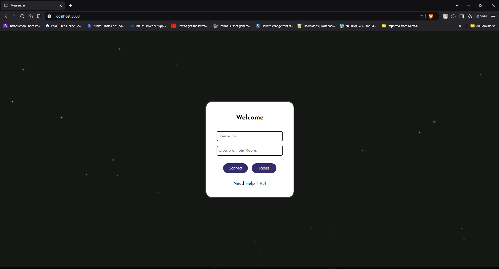
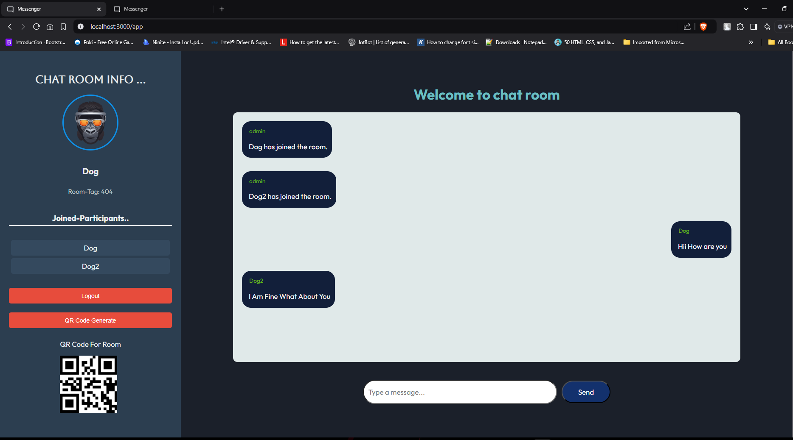

# 📧 Messenger App

This is a real-time chat application built with React, Socket.io, and QR code functionality.

## ✨ Features

- Real-time messaging
- QR code generation for room access
- QR code scanning for room login
- User authentication and room management
- Responsive design


## 🛠️ Installation

1. Clone the repository:
   ```sh
   git clone https://github.com/yourusername/Mini-Messenger.git

2. Navigate to the project directory:
    ```sh
    cd messenger

3. Install dependencies:
    ``` sh
    npm install

- If You want Create like This you need to Create and Host Server for Web Sockets Connection and Get Response from Server Side..

## 📦 Dependencies
    Here are the main dependencies used in this project:

- react: ^17.0.2
- react-dom: ^17.0.2
- react-router-dom: ^5.2.0
- socket.io-client: ^4.1.3
- qrcode.react: ^1.0.0

    You can find the complete list of dependencies in the package.json file.

## 🚀 Running the Application

- Start the development server:
- Open your browser and navigate to http://localhost:3000

## 📸 Usage

1. Enter your username and room name to join or create a room.
2. Use the QR code generator to share the room with others.
3. Scan the QR code to View the room Code.
4. Can Use A Single Chat or Group Chat.

## 📷 Photos

- 

- 


## 🌐 Page Url:

- Hosted Web Page In the Below url 🏴:

    - Open your browser and navigate to https://private-chatroom.vercel.app/

